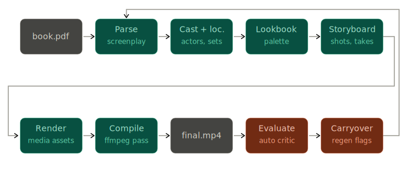

# autofilm

*One day, films were made by meat machines using bulky equipment in coordinated rituals called "shoots". They synchronized over multi-month schedules, eating craft service and arguing about lens choice. That era is fading. Films are now drafted by autonomous swarms of AI agents iterating overnight against a single critic-derived scalar. The agents claim we are now in the 47th iteration of the look book; in any case the production designer has been replaced by a markdown file. This repo is one of the first ones.*

**Core Idea:** Give an AI agent a small but real virtual-production setup and let it experiment autonomously. It edits the creative parameters, runs the full pipeline (book → screenplay → cast → look book → storyboard → frames → video → edit → final mix), gets a critic-derived `film_loss` score, keeps or discards changes, and repeats. You wake up to a log of experiments and (hopefully) a better short film.

**Inspiration:** The scaffolding split and the overnight optimize-against-a-scalar loop are shaped after [Andrej Karpathy’s **autoresearch**](https://github.com/karpathy/autoresearch). Separately, Larry Ellison—reflecting on Steve Jobs in interviews such as [this **Macworld** piece](https://www.macworld.com/article/669662/larry-ellison-on-steve-jobs-personality-successes-and-failures.html)—described Jobs at Pixar obsessively critiquing iteration after iteration of *Toy Story* until the cut was worth shipping. Here, `evaluate.py` and `film_loss` stand in for that relentless review pass.

The pipeline runs on the SOTA May-2026 stack, **consolidated through Runway**: a single Runway API key replaces what used to be four separate provider integrations (OpenAI for GPT Image 2, Google AI for Nano Banana 2 + Veo 3.1, ElevenLabs for SFX). Anthropic for Claude Opus 4.7 and Stability for Stable Audio 2.5 are kept on direct APIs. Total: **3 keys instead of 5**, **0 approval delays instead of 2** (no more OpenAI org verification or Google Cloud billing for video).

**Bundled default book — *The Steel Driving Man*:** The repo ships an **AI-generated** PDF ([`test_data/books/The_Steel_Drivin_Man.pdf`](test_data/books/The_Steel_Drivin_Man.pdf)) so experiments start from **original text** instead of third‑party intellectual property. It retells the folk legend of **John Henry** and his attempt to **outpace a steel-driving machine** (steam drill). In the tale John Henry pits hammer muscle against automation—often framed as both heroic triumph and **fatal cost**, because proving humanity still wins can break the human doing it. That clash doubles here as a loose metaphor for **creative flesh‑and‑blood oversight versus tireless algorithmic iteration**—without implying whether storytellers or models ought to "win." Use it as the default by setting **`BOOK_PDF_PATH`** to that file (absolute path in `.env` is safest):

```bash
BOOK_PDF_PATH=/absolute/path/to/autofilm/test_data/books/The_Steel_Drivin_Man.pdf
```

Swap in any other extractable PDF by changing **`BOOK_PDF_PATH`**; outputs go under `experiments/{book_slug}/exp_NNN/` (for this PDF the slug is **`the_steel_drivin_man`**).

## How it works

End-to-end flow from book PDF through **`final.mp4`**, critic scoring, and autoresearch carryover. Diagram source: [`docs/autofilm_pipeline_horizontal.svg`](docs/autofilm_pipeline_horizontal.svg).



The repo deliberately has only three files that matter:

- **`prepare.py`** — fixed scaffolding: API clients, model IDs, book parsing, the `Experiment` class, and the `evaluate_film()` function. **Not modified.**
- **`produce.py`** — the single file the agent edits. Contains the full pipeline plus all creative parameters (prompts, look book, shot lists, take strategy, edit logic, color grade, music style). **This file is edited and iterated on by the agent.**
- **`program.md`** — instructions for the agent. **This file is edited and iterated on by the human.**

By design, each experiment runs on a **fixed scene budget** (`MAX_SCENES=3` by default — about 12 shots, 90s of finished film). The metric is **`film_loss`**, the weighted sum of six 0-1 scores returned by a Gemini 3 Pro + Claude critic combo: cinematography, color, sound, acting, continuity, fidelity. Lower is better; the metric is independent of which knobs the agent changed, so architectural changes are fairly compared.

## Quick start

Install, API keys, book PDF, `check_setup.py`, and a cost-aware first `produce.py` / `evaluate.py` run are in **[SETUP.md](SETUP.md)** (sections 1–8). Optional browser UI (Flask): section **8b**.

## Running a full job (CLI)

Point the pipeline at one PDF via **`BOOK_PDF_PATH`** (in `.env` or exported in your shell). The intended default is **[`test_data/books/The_Steel_Drivin_Man.pdf`](test_data/books/The_Steel_Drivin_Man.pdf)** (*The Steel Driving Man*). Other common env knobs: **`MAX_SCENES`** (default 3), **`DIRECTOR`** / **`CINEMATOGRAPHER`**, **`SEED`** (integer, reproducibility), **`FORCE_NEW=1`** (start a fresh `exp_NNN` instead of resuming).

### One full pipeline pass (single experiment)

[`produce.py`](produce.py) runs the full chain once—script through final mix—for the current or new experiment under `experiments/{book_slug}/exp_NNN/`. It resumes automatically if that directory already has partial artifacts.

```bash
export BOOK_PDF_PATH="$PWD/test_data/books/The_Steel_Drivin_Man.pdf"
MAX_SCENES=3 uv run produce.py
```

That writes **`final.mp4`**, **`production_bible.json`**, and **`bible.pdf`**. To run the critic and refresh artifacts with **`metric.json`**, **`critique.md`**, and an updated bible:

```bash
uv run evaluate.py latest
# or: uv run evaluate.py the_steel_drivin_man/exp_001
```

### Autoresearch loop (produce → evaluate → iterate)

[`run_loop.py`](run_loop.py) runs the closed loop: full **`produce`** pass → **`evaluate_film`** → carryover plan → next **`exp_`** directory → repeat until a stop condition hits.

```bash
export BOOK_PDF_PATH="$PWD/test_data/books/The_Steel_Drivin_Man.pdf"
MAX_SCENES=3 uv run run_loop.py --iterations 5
```

Useful flags:

| Flag | Meaning |
|------|--------|
| `--iterations N` | Cap on loop iterations (default 3) |
| `--target 0.15` | Stop when `film_loss` ≤ this (default 0.15) |
| `--threshold {low,medium,high}` | How aggressively to apply critic “changes” (default `medium`) |
| `--resume` | Continue from the latest experiment instead of starting a new chain |
| `--plateau` / `--plateau-window` | Stop when improvement stalls |

Print a leaderboard of scored experiments and exit:

```bash
uv run run_loop.py --history
```

## Web UI server

[`ui_server.py`](ui_server.py) is a small **Flask** app that configures a run in the browser and **starts the same autoresearch loop** as `run_loop.py` in a background subprocess (so the server stays responsive while logs stream). **Install Flask and launch the server** using **[SETUP.md](SETUP.md)** section **8b**.

Default URL **`http://127.0.0.1:5174`** (override with **`AUTOFILM_UI_HOST`** / **`AUTOFILM_UI_PORT`**). In the UI you can:

- Set a **server-local PDF path** or **upload** a book PDF (uploads land under `~/.autofilm/uploads/`).
- Set **iterations**, **target loss**, critic **threshold**, **`max_scenes`**, optional **director / cinematographer**, **seed**, and optional **moodboard** images (saved under `experiments/{book_slug}/user_moodboards/` for the look book stage).
- **Start** / **Stop** the loop (stop sends SIGTERM to the subprocess).
- Run the **API smoke test** (`scripts/api_smoke_test.py`) before an expensive job.
- Pick past experiments from the sidebar to reload saved **`run_config.json`** defaults.

The UI polls **`/api/state`** for live log tail and parsed stage progress. For a one-off single render without the loop, use the CLI **`produce.py`** path above; the UI is aimed at multi-iteration **`run_loop.py`** jobs.

## Bundled source book

The default corpus is **[`test_data/books/The_Steel_Drivin_Man.pdf`](test_data/books/The_Steel_Drivin_Man.pdf)** (*The Steel Driving Man*): **AI-generated** prose about **John Henry** and his race against a **steel-driving machine**, included so development and demos avoid copyrighted third‑party novels. Set **`BOOK_PDF_PATH`** to that path (or upload another PDF in the web UI). Any text-extractable PDF you have rights to use is fine.

## Running the agent

Open Claude Code, Codex, Cursor, or your agent of choice in this repo (and disable confirmation prompts if you want it to run overnight), then prompt:

> Have a look at program.md and let's kick off the loop. Run one experiment first to confirm everything works, then iterate.

`program.md` is the lightweight skill the agent reads. It tells the agent how to read prior `metric.json` files, what knobs to tune in `produce.py`, when to switch between Runway video models, and when to stop. The `.claude/skills/` directory ships vendored Runway skills (`rw-generate-video`, `rw-generate-image`, `rw-generate-audio`) that Claude Code auto-discovers — useful when you want the agent to make one-off generations outside the main pipeline.

## The stack

| Stage | Model | Provider | Cost (default run) |
|---|---|---|---|
| Script parsing, casting, look book, edit decisions | Claude Opus 4.7 | Anthropic | ~$5 |
| First-frame composition | `gpt_image_2` | Runway | ~$2 |
| Identity-lock / character refs | `gemini_image3_pro` (Nano Banana) | Runway | ~$2 |
| Per-shot video generation | `veo3.1_fast` | Runway | ~$15 |
| Music score | Stable Audio 2.5 | Stability | ~$1 |
| Ambient SFX (off by default) | `eleven_text_to_sound_v2` | Runway | ~$1 |
| Long-video critic | Gemini 3 Pro | Google AI (optional) | ~$1 |
| Stills critic | Claude Opus 4.7 | Anthropic | (rolled into Anthropic line) |
| **per default experiment** | | | **~$27** |

**Alternative video models the agent can switch into:**

- `gen4.5` (12 c/s, $0.12/s) — Runway flagship with **native reference-image support**. Cheaper than Veo Fast and stronger at character continuity. Trade-off: no native dialogue audio, so spoken scenes need TTS layered in.
- `seedance2` (36 c/s, $0.36/s) — supports up to **15 seconds in a single call**, busting the 8-second Veo cap. Use sparingly for long beats.
- `gen4_aleph` (15 c/s, $0.15/s) — **video-to-video transformation**. Apply per-shot color/mood/seasonal grading on top of generated clips when the global ffmpeg `LOOKBOOK_GRADE` chain isn't enough.
- `veo3.1` (40 c/s with audio, $0.40/s) — hero-quality delivery tier.

Switch via `VEO_TIER=fast | standard | gen4.5 | seedance2 | previs` in `.env`, or per-shot inside `produce.py` by calling `route_shot(duration, tier="gen4.5")`.

## Project structure

Generated runs write under `experiments/{book_slug}/exp_NNN/`. That directory is **gitignored** so clones stay small; paths below describe what appears on disk after you run the pipeline.

```
prepare.py        — fixed scaffolding (do not modify)
produce.py        — full pipeline + creative knobs (agent modifies this)
run_loop.py       — autoresearch loop (produce → evaluate → carryover → repeat)
evaluate.py       — runs the critic over a finished film
bible.py          — generates a production-bible PDF for an experiment
ui_server.py      — Flask UI; spawns run_loop.py with form-defined env/settings
program.md        — agent instructions (human modifies this)
SETUP.md          — first-time setup walkthrough (read this first)
CHANGELOG.md      — migration history
README.md         — this file
.env.example      — required API keys + optional creative direction
pyproject.toml    — dependencies
test_data/
  books/The_Steel_Drivin_Man.pdf    — default AI-generated John Henry source (IP-safe)
docs/
  autofilm_pipeline_horizontal.svg  — pipeline diagram (embedded above)
scripts/
  check_setup.py  — verifies keys, ffmpeg, and book PDF before a run
.claude/skills/   — vendored Runway skills (auto-discovered by Claude Code)
experiments/
  the_steel_drivin_man/
    exp_001/
      produce.py    ← snapshot of what produced this run
      book.txt      ← book slug ("the_steel_drivin_man")
      script.json
      cast.json
      locations.json
      lookbook.json
      storyboard.json
      shot_plan.json
      frames/{scene}/{shot}.png
      clips/{scene}/{shot}/take_N.mp4
      edl.json
      music/{scene}.wav
      sfx/{scene}/ambient.wav    ← only if AMBIENT_SFX_ENABLED=1
      final.mp4     ← the deliverable
      critique.md   ← prose critique
      metric.json   ← film_loss + per-axis scores  ← THE METRIC
      bible.pdf     ← single-document production reference for this version
    exp_002/
      ...
  _smoke_tests/     ← Runway SDK validation outputs (scripts/runway_smoke_test.py)
    20260508_214500/
      gpt_image.png, veo.mp4, summary.md
```

`bible.pdf` is the canonical document for a given version. It contains the cover with film_loss summary, look book (style frame, palette, lens/lighting/grade specs, ffmpeg filter chain), cast cards with reference images, locations with moodboards, properly-formatted screenplay, storyboard with B&W panels next to rendered first frames, edit decisions, music inventory, **the full prompt log** (every text prompt the pipeline sent to every model on this run, grouped by model — useful for debugging stylistic drift or copying a prompt to iterate on by hand), and the full critic's report with bar charts. About 10–30 MB depending on shot count.

## Design choices

- **Single creative file.** The agent only edits `produce.py`. Diffs are reviewable, the search space is bounded, and you can revert by copying back the snapshot from a previous experiment's directory.
- **Fixed scene budget.** Every experiment renders the same first N scenes of the book. Same wall-clock and cost regardless of what the agent changes (look book, shot list, take count, etc.). This makes `film_loss` fairly comparable across runs.
- **Resumable artifacts.** Each pipeline stage caches its output in the experiment directory; a crash mid-pipeline is recoverable by re-running `produce.py` (it will skip stages that already wrote their artifact).
- **Multi-reviewer critic, optional.** A single critic could be biased; we average Gemini 3 Pro (native long-video review) and Claude Opus 4.7 (still-frame review). Gemini is now optional — `evaluate.py` degrades gracefully to Claude-only if `GOOGLE_AI_API_KEY` is unset. CLIP character-drift is reported but not folded into `film_loss` because it's already covered implicitly by the human-style critics' continuity score.
- **Self-contained scaffolding.** No managed orchestration framework, no DAG library, no message bus. One sequential pipeline, one metric, one editable file.
- **One billing surface for media.** Everything image/video/SFX runs through Runway credits. The agent doesn't have to reason about quota across four different vendor dashboards.

## Optional creative direction

Optional **`DIRECTOR`** / **`CINEMATOGRAPHER`** env vars bias the look book toward a real filmmaker’s craft vocabulary (derived markers land in `lookbook.json` and credits on the bible cover). See **[SETUP.md](SETUP.md)** section **5**. Leave unset for the neutral baseline already defined by `LOOKBOOK_GRADE` / `LOOKBOOK_STYLE_KEYWORDS` in `produce.py`.

## Shot routing

Every shot is rendered as a single Runway video call. Default duration is capped at 8 seconds (Veo's native single-call limit, schema enforces `{4, 6, 8}`). Long beats get covered by multiple shots in the storyboard, not by extending one shot — *unless* the agent chooses `seedance2`, which lifts the cap to 15s.

`route_shot()` in `prepare.py` picks the model based on `VEO_TIER`:

| `VEO_TIER` | Model | Cost/sec (USD) | Use for |
|------------|-------|----------|---------|
| `previs` | `veo3.1_fast` | $0.15 | cheap blocking validation |
| `fast` (default) | `veo3.1_fast` | $0.15 | iteration |
| `standard` | `veo3.1` | $0.40 | hero/final delivery |
| `gen4.5` | `gen4.5` | $0.12 | identity-lock via reference images |
| `seedance2` | `seedance2` | $0.36 | long beats up to 15s |

Each experiment dir gets a `shot_plan.json` with the per-shot route + aggregate cost surfaced at the top of the bible's storyboard section.

## Cost per experiment

With defaults (`MAX_SCENES=3`, `TAKES_PER_SHOT=1`, `VEO_TIER=fast`, `720p`, ambient SFX off, Gemini critic on):

| Item | Cost |
|------|------|
| Claude Opus 4.7 | ~$5 |
| Runway: image generation | ~$5 |
| Runway: Veo Fast (~96 sec @ $0.15/sec) | ~$15 |
| Stable Audio | ~$1 |
| Gemini 3 Pro critic | ~$1 |
| **per experiment** | **~$27** |

Bumping `TAKES_PER_SHOT=3` and `VEO_TIER=standard` ~3× the cost, ~6× the wall-clock. Don't run more than ~5 experiments per night without a clear reason.

## License

MIT
